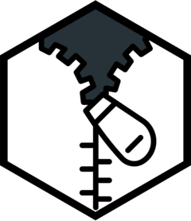

<!-- README.md is generated from README.Rmd. Please edit that file -->

```{r, include = FALSE}
library(knitr)
knitr::opts_chunk$set(
  collapse = TRUE,
  comment = "#>",
  fig.path = "man/figures/README-",
  out.width = "100%"
)
if (!interactive()) {
  options(width = 99)
}
```

# zippr 

<!-- badges: start -->
[![Lifecycle: experimental][life_badge]][life_link]
[![CRAN status][cran_badge]][cran_link]
[![Codecov test coverage][cov_badge]][cov_link]
[![R build status][ga_badge]][ga_link]
<!-- badges: end -->

The goal of zippr is to provide an alternative to the [zip] package built on
[miniz], a cross-platform, lossless, high performance data compression library.
The exact functionality of this package is still extremely fluid.

Three main types of changes are being made:

1. Consistently rename _all_ functions with `zip_*` to avoid masking
   `utils::zip()` and `utils::unzip()`.
2. Arrange arguments in a consistent order, accepting the primary file paths as
   the first argument for easy piping.
3. Return more data (sometimes invisibly) with [tibble] and [fs] classes.

## Installation

You can install the development version of zippr from [GitHub][gh] with:

```{r install, eval=FALSE}
# install.packages("remotes")
remotes::install_github("kiernann/zippr")
```

<!-- refs: start -->
[life_badge]: https://img.shields.io/badge/lifecycle-experimental-orange.svg
[life_link]: https://www.tidyverse.org/lifecycle/#experimental
[cran_badge]: https://www.r-pkg.org/badges/version/zippr
[cran_link]: https://CRAN.R-project.org/package=zippr
[ga_badge]: https://github.com/kiernann/zippr/workflows/check-standard/badge.svg
[ga_link]: https://github.com/kiernann/zippr/actions
[cov_badge]: https://codecov.io/gh/kiernann/zippr/branch/master/graph/badge.svg
[cov_link]: https://codecov.io/gh/kiernann/zippr?branch=master
[dl_badge]: https://cranlogs.r-pkg.org/badges/grand-total/zippr
[zip]: https://github.com/r-lib/zip
[miniz]: https://github.com/richgel999/miniz
[fs]: https://github.com/r-lib/fs/
[tibble]: https://github.com/tidyverse/tibble/
[gh]: https://github.com/kiernann/zippr
<!-- refs: end -->
